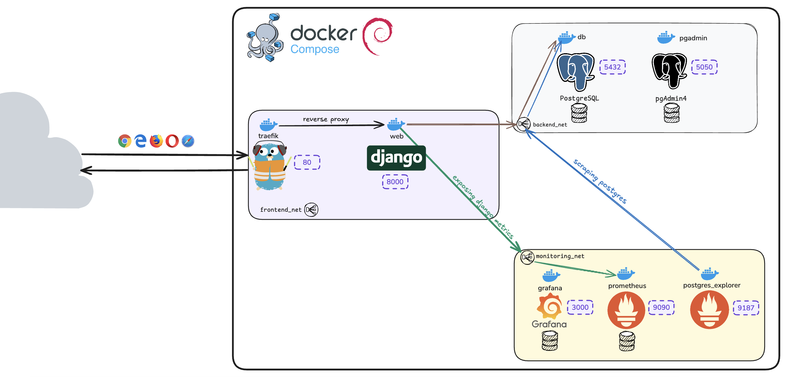

# Intro

Ce répo présente la partie Frontend du projet `SLAB-VPN`, qui fournit des informations sur les enregistrements d'IPs entrantes et sortantes des principaux providers VPN.
Les données sont récupérées depuis une base de données PostgreSQL et sont présentés sur l'application Django. Une API est également disponible.
La base PostgreSQL est alimenté par la partie Backend du projet.

Les services :

- `Traefik` : Reverse proxy pour les services web.
- `Django` : Application web
- `PostgreSQL` : Base de données qui récupère les données VPN et stocke le business Django.
- `PgAdmin` : Interface web pour gérer la base de données.
- `Prometheus` : Collection de metrics.
- `Postgres Exporter` : Exportateur de metrics pour PostgreSQL.
- `Grafana` : Outil de visualisation pour les metrics.



# Installation

- Créer les fichiers `db.env` et `web.env` à la racine du projet et ajouter les variables d'environnement correspondantes (ci-dessous).
- Ajouter les mots de passes des 2 users postgres dans le script `init-db.sql` qui se situe dans le dossier `init-scripts`.
- Exécuter `docker-compose up --build` pour démarrer les services.

## Variables d'environnement

### Database Configuration (`db.env`)
Voici la traduction en français des descriptions :

| Variable                   | Description                                                                                     |
|----------------------------|-------------------------------------------------------------------------------------------------|
| `DJANGO_POSTGRES_DB`       | Nom de la base de données pour les données liées à Django                                      |
| `DJANGO_POSTGRES_USER`     | Utilisateur Postgres pour la base de données Django                                            |
| `DJANGO_POSTGRES_PASSWORD` | Mot de passe pour l'utilisateur de la base de données Django                                   |
| `DJANGO_POSTGRES_HOST`     | Hôte pour la base de données Django                                                            |
| `DJANGO_POSTGRES_PORT`     | Port pour la base de données Django                                                            |
| ---                        | ---                                                                                             |
| `DATA_POSTGRES_DB`         | Nom de la base de données pour VPN                                                             |
| `DATA_POSTGRES_USER`       | Utilisateur pour la base de données VPN                                                        |
| `DATA_POSTGRES_PASSWORD`   | Mot de passe pour l'utilisateur de la base de données VPN                                      |
| `DATA_POSTGRES_HOST`       | Hôte pour la base de données VPN                                                               |
| `DATA_POSTGRES_PORT`       | Port pour la base de données VPN                                                               |
| ---                        | ---                                                                                             |
| `PGADMIN_DEFAULT_EMAIL`    | Email par défaut pour PgAdmin                                                                  |
| `PGADMIN_DEFAULT_PASSWORD` | Mot de passe par défaut pour PgAdmin                                                           |
| ---                        | ---                                                                                             |
| `DATA_SOURCE_NAME`         | URL de connexion : postgres://<nom_utilisateur>:<mot_de_passe>@<nom_service_bdd>:5432/<nom_bdd>?sslmode=disable |

### Configuration Web (`web.env`)

| Variable                     | Description                                       |
|------------------------------|---------------------------------------------------|
| `SECRET_KEY`                 | Clé secrète de Django                             |
| `DEBUG`                      | Activer le mode debug (1 pour True, 0 pour False) |
| `DJANGO_ALLOWED_HOSTS`       | Hôtes autorisés (séparés par un espace simple)    |
| `GF_SECURITY_ADMIN_PASSWORD` | Mot de passe administrateur pour Grafana          |
| `JWT_SECRET_KEY`             | Clé secrète pour générer les tokens JWT           | 


# Endpoints API

---

### 0. **Obtenir un token JWT**

- **URL**: `/api/token/`
- **Méthode**: `POST`
- **Paramètres de requête**:
  - `username` (obligatoire) : Le nom d'utilisateur de l'utilisateur.
  - `password` (obligatoire) : Le mot de passe de l'utilisateur.
- **Réponse**:
  - **200 OK** : Un token d'authentification pour l'utilisateur.
  - **401 Unauthorized** : Si les informations d'identification fournies sont incorrectes.
  -  Exemple de requête:
    ```
    /api/token/
    ```
  
---

### 1. **Obtenir le nombre de pays uniques par fournisseurs**

- **URL**: `/api/providers/countries/`
- **Méthode**: `GET`
- **Paramètres de requête**:
  - `months` (optionnel) : Le nombre de mois à considérer pour le comptage des pays par fournisseur. Par défaut, il est de 3 mois s'il n'est pas spécifié.
- **Réponse**:
  - **200 OK** : Une liste des fournisseurs avec le nombre de pays auxquels ils sont associés pendant les derniers `months` mois.
  - **404 Not Found** : Si aucune donnée n'est trouvée.
  - **Exemple de requête**:
    ```
    /api/providers/countries/?months=3
    ```
  - **Exemple de réponse**:
    ```json
    [
      {
        "provider_id": "uuid",
        "provider_name": "Nom du fournisseur",
        "country_count": 5
      }
    ]
    ```

---

### 2. **Obtenir le nombre de serveurs par fournisseurs**

- **URL**: `/api/providers/servers/`
- **Méthode**: `GET`
- **Paramètres de requête**:
  - `months` (optionnel) : Le nombre de mois à considérer pour le comptage des serveurs par fournisseur. Par défaut, il est de 3 mois s'il n'est pas spécifié.
- **Réponse**:
  - **200 OK** : Une liste des fournisseurs avec le nombre de serveurs auxquels ils sont associés pendant les derniers `months` mois.
  - **404 Not Found** : Si aucune donnée n'est trouvée.
  - **Exemple de requête**:
    ```
    /api/providers/servers/?months=3
    ```
  - **Exemple de réponse**:
    ```json
    [
      {
        "provider_id": "uuid",
        "provider_name": "Nom du fournisseur",
        "server_count": 10
      }
    ]
    ```

---

### 3. **Obtenir les enregistrements d'IP entrantes depuis une période donnée**

- **URL**: `/api/in_ips/`
- **Méthode**: `GET`
- **Paramètres de requête**:
  - `ip` (obligatoire) : L'adresse IP à rechercher.
  - `date_since` (obligatoire) : La date à partir de laquelle filtrer les enregistrements.
- **Réponse**:
  - **200 OK** : Une liste des enregistrements filtrés correspondant à l'IP et à la date données.
  - **400 Bad Request** : Si les paramètres `ip` ou `date_since` sont manquants dans les paramètres de la requête.
  - **404 Not Found** : Si aucun enregistrement n'est trouvé.
  - **Exemple de requête**:
    ```
    /api/in_ips/?ip=192.168.1.1&date_since=2024-01-01T00:00:00Z
    ```
  - **Exemple de réponse**:
    ```json
    [
      {
        "id": "uuid",
        "ip": "192.168.1.1",
        "server": {
          "id": "uuid",
          "name": "Nom du serveur",
          "provider": {
            "id": "uuid",
            "name": "Nom du fournisseur"
          },
          "location_type": "City",
          "city_name": "Nom de la ville",
          "country_name": "Nom du pays"
        },
        "created_at": "2024-01-01T10:00:00Z",
        "updated_at": "2024-01-01T12:00:00Z"
      }
    ]
    ```

---

### 4. **Obtenir les enregistrements d'IP sortantes depuis une période donnée**

- **URL**: `/api/out_ips/`
- **Méthode**: `GET`
- **Paramètres de requête**:
  - `ip` (obligatoire) : L'adresse IP à rechercher.
  - `date_since` (obligatoire) : La date à partir de laquelle filtrer les enregistrements.
- **Réponse**:
  - **200 OK** : Une liste des enregistrements filtrés correspondant à l'IP et à la date données.
  - **400 Bad Request** : Si les paramètres `ip` ou `date_since` sont manquants dans les paramètres de la requête.
  - **404 Not Found** : Si aucun enregistrement n'est trouvé.
  - **Exemple de requête**:
    ```
    /api/out_ips/?ip=192.168.1.1&date_since=2024-01-01T00:00:00Z
    ```
  - **Exemple de réponse**:
    ```json
    [
      {
        "id": "uuid",
        "ip": "192.168.1.1",
        "server": {
          "id": "uuid",
          "name": "Nom du serveur",
          "provider": {
            "id": "uuid",
            "name": "Nom du fournisseur"
          },
          "location_type": "City",
          "city_name": "Nom de la ville",
          "country_name": "Nom du pays"
        },
        "created_at": "2024-01-01T10:00:00Z",
        "updated_at": "2024-01-01T12:00:00Z"
      }
    ]
    ```